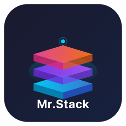

<div align="center">



# Mr.Stack

**ターミナルを閉じても機能するClaude。**

Claude Code + Telegram = あなたの24時間365日のAI開発パートナー

[](https://pypi.org/project/mrstack/)
[](https://python.org)
[](https://opensource.org/licenses/MIT)
[](https://apple.com/macos)
[](#compatibility)
[](#compatibility)
[](https://t.me/botfather)

</div>

---

## 30秒でインストール

```bash
uv tool install mrstack        # 1. インストール
mrstack init                    # 2. セットアップ (TelegramトークンとユーザーIDを入力)
mrstack start                   # 3. 起動！ (テスト実行、ターミナルを開いたままにする必要があります)
mrstack daemon                  # 4. デーモン登録 → ターミナルを閉じても24時間365日バックグラウンドで実行
```

Telegramでbotにメッセージを送信してください。返信があれば完了です。

> `uv` がない場合：代わりに `pip install mrstack` を使用してください。
> `mrstack init` は依存関係 (claude-code-telegramを含む) を自動で確認しインストールします。

<details>
<summary><b>すべてのCLIコマンド</b></summary>

```
mrstack init          # セットアップウィザード
mrstack start         # botを起動
mrstack start --bg    # バックグラウンドで起動
mrstack stop          # botを停止
mrstack daemon        # システムデーモンとして登録 (再起動時に自動起動)
mrstack daemon -u     # デーモンの登録解除
mrstack status        # ステータスを表示
mrstack logs -f       # ログをフォロー
mrstack config        # 設定を編集
mrstack jarvis on/off # Jarvisモードのオン/オフ切り替え
mrstack patch         # モジュールを再インストール
mrstack update        # 最新バージョンにアップデート
mrstack version       # バージョン情報を表示
```

</details>

---

## Mr.Stackとは？

[Claude Code](https://claude.ai)を基盤とした、**常時稼働**のTelegram AIパートナーです。

ターミナルを閉じても、MacBookを閉じても、外出中でも、24時間365日機能します。
Claude Codeがターミナルに縛られているのに対し、Mr.Stackは**ポケットに入るClaude**です。

> 一般的なAIアシスタントはコールセンターのようなもので、質問されたときにのみ答えます。
> Mr.Stackは**隣に座って同じ画面を見ている、経験豊富な同僚**です。

---

## 主な機能

### 1. Telegram AI アシスタント

Telegramのメッセージ1つでClaudeに指示を出せます。

- コードの作成 / 編集 / デバッグ / リファクタリング
- ファイル、写真、音声メッセージの処理
- 音声入力、音声出力 (Whisper + TTS)
- クリップボードのコンテンツ自動解析 (エラー → 根本原因、URL → 要約、コード → レビュー)

### 2. 学習 — リンクを送信し、「これを学習して」と伝えるだけ

**これがMr.Stackの最も簡単な使い方です。** リンク、ドキュメント、ファイルをTelegramに送り、**「これを学習して」**と言ってください。

```
[あなた]       https://docs.example.com/api-guide
            これを学習して

[Mr.Stack]  APIガイドを解析しました:
            - 認証: Bearer トークン
            - レート制限: 100リクエスト/分
            - 12個の主要エンドポイント
            メモリに保存しました。後でこのAPIについて何でも聞いてください。
```

PDF、Webページ、コードファイル、画像など、送信されたあらゆるものを読み取り、記憶します。
後で**「あのAPIドキュメントの認証方法は何だった？」**と聞けば、即座に答えます。

### 3. 永続的なメモリ — 忘れないAI

ほとんどのAIはウィンドウを閉じるとリセットされますが、Mr.Stackは**記憶します**。

- 3時間ごとに会話が分析され、意味のある情報が永久に保存されます
- プロジェクトの進捗、技術的決定、担当者、設定内容が自動的に更新されます
- **「昨日作業していたところから続けて」** → まさに中断したところから再開します
- 1年間の使用で約10〜15MBの総ストレージ容量 (写真1枚分以下)

```
~/claude-telegram/memory/
  people/       → 人物情報 (上書き)
  projects/     → プロジェクト進捗 (上書き)
  decisions/    → 決定と根拠 (追記)
  preferences/  → あなたの環境設定 (上書き)
  daily/        → 日次の要約 (1日1回)
  knowledge/    → 学習した知識 (上書き)
  patterns/     → 作業パターンのデータ
```

### 4. 常時稼働システム (Jarvisモード)

Macを**5分ごと**にスキャンし、注意が必要なときに連絡してきます。

| 状況 | Mr.Stackの反応 |
|-----------|-------------------|
| バッテリー残量が20%未満 | "バッテリー残量が12%です。作業を保存してください" |
| 離席から戻ったとき | "おかえりなさい。feature/authブランチの作業中でしたね" |
| 3時間以上連続でコーディング | "休憩を取りましょう" |
| 同じファイルを30分触ってコミットなし | "どこかで行き詰まっていますか？" |
| ディープワークモード (2時間以上集中) | 重要なアラートのみ通知 |

> JarvisはmacOSで最適に動作します。Linuxでは、CPU/バッテリー/Gitの監視は正常に機能しますが、アクティブなアプリやChromeタブの検出はmacOSのみの対応です。

### 5. パターン学習と日次コーチング

作業習慣を分析し、毎晩データに基づくコーチングレポートを送信します：

```
[デイリーコーチ] 2026-02-28

生産性: 8/10 (昨日から+1)

良かった点:
  朝の2時間集中ブロック → 4コミット

改善領域:
  午後2時〜4時の間に7回のコンテキストスイッチが発生 — 効率が低下した時間帯でした
  → 明日のこの時間はシングルタスクのブロックを試してみましょう
```

### 6. スケジュール化された自動化処理

一度設定すれば、毎日実行されます：

| ジョブ | スケジュール |
|-----|----------|
| 朝のブリーフィング (カレンダー + タスク + ニュース) | 平日 08:00 |
| 夜のサマリー + コーチングレポート | 毎日 21:00 |
| 週次レビュー | 金曜 18:00 |
| カレンダーリマインダー | 平日 09/12/15/18 |
| 会話 → メモリ自動更新 | 3時間ごと |
| GitHub通知チェック | 2時間ごと |

> モデルのルーティング: 簡単な検索にはHaiku、分析にはSonnet、深いレビューにはOpus。コストは自動最適化されます。

### 7. コンテキストに応じたトーン

| 状態 | トーン | 例 |
|-------|------|---------|
| コーディング中 | 簡潔 | `"auth.py:42 — nullチェックが抜けています"` |
| ディープワーク中 | 無音 | 緊急時のみ |
| 戻ったとき | 要約 | `"おかえりなさい。PR #23 がレビュー待ちです"` |
| 午後10時以降 | 心配 | `"今日の作業はもう十分です"` |

### 8. 外部統合 (オプション)

MCPを介して外部サービスに接続できます。**コア機能はこれらがなくても機能します。**

| サービス | 機能 |
|---------|-----------|
| Google Calendar | イベント、リマインダー |
| Notion | 自動作業ログ |
| GitHub | PR/Issue/通知の監視 |
| Playwright | Web自動化 |

---

## 違いは何ですか？

| | 一般的なAI Bot | Mr.Stack |
|---|---------------|----------|
| **やり取り** | 尋ねられたときに答える | **プロアクティブなアラート** |
| **セキュリティ** | APIキーが外部に送信される | **ローカルマシンのみで実行** |
| **可用性** | ターミナルに縛られる | **24時間365日のバックグラウンドデーモン** |
| **メモリ** | 閉じるとリセット | **永続的なメモリ** |
| **学習** | なし | **パターン分析とルーティン予測** |
| **コーチング** | なし | **データドリブンな日次コーチング** |
| **データ** | クラウド | **100%ローカル** |

---

## インストールの詳細

### 前提条件

| 必要なもの | どこで |
|------|-------|
| **Claude Code** | [claude.ai/download](https://claude.ai/download) — Maxプラン推奨 |
| **Telegramアカウント** | [telegram.org](https://telegram.org) |

### Telegram Botの作成 (2分)

1. Telegramで **[@BotFather](https://t.me/botfather)** を検索 → `/newbot` を送信
2. botの名前を入力 (例: `My Stack Bot`)
3. botのユーザー名を入力 (例: `my_stack_bot`)
4. **トークン** (`1234567890:ABCdef...`) を保存

### Telegram ユーザーIDの確認 (30秒)

1. **[@userinfobot](https://t.me/userinfobot)** に何でもいいのでメッセージを送信
2. **数値ID**を保存

### インストールと起動

```bash
uv tool install mrstack    # インストール
mrstack init               # トークンとユーザーIDを入力、自動設定
mrstack start              # 起動！
```

`mrstack init` は以下を自動的に処理します：
- Claude Codeのインストール確認
- claude-code-telegramのインストール (不足している場合)
- `.env` 設定ファイルの作成
- メモリディレクトリのセットアップ
- Jarvisモードの設定 (macOS)

### バックグラウンドデーモンとして実行

```bash
mrstack daemon    # システムデーモンとして登録 → 再起動時に自動起動
```

### botのプロフィール写真の設定 (オプション)

1. [@BotFather](https://t.me/botfather) に `/mybots` を送信 → あなたのbotを選択 → Edit Botpic
2. `assets/bot-profile.png` を送信

<details>
<summary><b>高度な設定: ソースからのインストール</b></summary>

```bash
git clone https://github.com/whynowlab/mrstack.git
cd mrstack
pip install -e .
mrstack init
```

開発への貢献やカスタマイズ向け。

</details>

<details>
<summary><b>高度な設定: Claude Codeを使用したインストール</b></summary>

Claude Codeのターミナルで：
```
Look at github.com/whynowlab/mrstack and install Mr.Stack for me.
```

ClaudeがREADMEを読み、セットアップを案内してくれます。

</details>

<details>
<summary><b>オプション: 外部サービスの統合</b></summary>

**Google Calendar**
```json
// mcp-config.json
{
  "mcpServers": {
    "google-calendar": {
      "command": "npx",
      "args": ["-y", "@anthropic/mcp-google-calendar"],
      "env": {
        "GOOGLE_CLIENT_ID": "your-id",
        "GOOGLE_CLIENT_SECRET": "your-secret"
      }
    }
  }
}
```

**Notion**
```json
{
  "mcpServers": {
    "notion": {
      "command": "npx",
      "args": ["-y", "@anthropic/mcp-notion"],
      "env": { "NOTION_API_KEY": "ntn_..." }
    }
  }
}
```

**GitHub** — `gh auth login` を実行するだけです。

**Playwright** — `npx playwright install chromium`

</details>

---

## Telegramコマンド

| コマンド | 説明 |
|---------|-------------|
| `/new` | 新しい会話を開始 |
| `/status` | セッションとコストの概要 |
| `/repo` | プロジェクトを切り替え |
| `/jarvis` | Jarvisを一時停止/再開 |
| `/coach` | 日次のコーチングレポート |
| `/jobs` | スケジュールされたジョブのリスト |
| `/voice` | 音声レスポンスの切り替え |
| `/clipboard` | クリップボードの自動解析 |
| `/help` | コマンドリファレンス全体 |

---

## 互換性

| プラットフォーム | サポートレベル |
|----------|--------------|
| **macOS** (Ventura / Sonoma / Sequoia) | 100% — すべての機能 + 24時間バックグラウンド実行のための `daemon` |
| **Linux** | 95% — `daemon` サポート。Jarvisのアクティブアプリ/Chromeタブ検出は利用不可 |
| **Windows** | 近日対応予定 |

| 要件 | バージョン |
|-------------|---------|
| Python | 3.11+ |
| claude-code-telegram | v1.3.0+ |
| Claude Code | Maxプラン推奨 |

---

## セキュリティとプライバシー

- **100%ローカル** — すべてのデータはあなたのマシンにのみ保存されます。外部サーバーへの送信はありません
- **ユーザー認証** — `ALLOWED_USERS` にあるTelegram IDのみが許可されます
- **サンドボックス** — Claudeのファイルアクセスは `APPROVED_DIRECTORY` に制限されます
- **品質ゲート** — 危険なコマンド (`rm -rf`, `sudo`, `curl | sh`) はブロックされます
- ClaudeのAPI呼び出しのみがAnthropicのサーバーを経由します (Claude Code自体と同じです)

---

## よくある質問 (FAQ)

<details>
<summary><b>無料のClaude Codeでも動きますか？</b></summary>

動作しますが、すぐにレート制限に達します。**Maxプランを強く推奨します。**
Mr.Stack自体は無料（オープンソース）で、サーバー費用はゼロです。

</details>

<details>
<summary><b>AnthropicのAPIキーは必要ですか？</b></summary>

いいえ。Claude Codeに組み込まれている認証を使用します。

</details>

<details>
<summary><b>本当にパソコンを閉じても動くのですか？</b></summary>

はい。`mrstack daemon` はシステムデーモンを登録します：
- 起動時に自動開始、クラッシュ時に自動再起動
- （電源接続時）パソコンを閉じたままでもバックグラウンドで実行
- どこからでもTelegram経由でアクセス可能

</details>

<details>
<summary><b>トークンをたくさん消費しますか？</b></summary>

1日あたり約15〜20回の追加API呼び出しです。Maxプランでは無視できる程度です。
5分ごとのポーリング、パターンのログ記録、状態の分類は**トークン消費ゼロ**です（ローカルのみ）。

</details>

<details>
<summary><b>私のデータは外部に送信されますか？</b></summary>

**絶対にされません。** すべてのデータはローカルファイル（SQLite、JSONL、Markdown）に保存されます。

</details>

---

## 技術スタック

| レイヤー | 技術 |
|-------|-----------|
| ランタイム | Python 3.11 + asyncio |
| AI エンジン | Claude Code SDK (Opus / Sonnet / Haiku) |
| インターフェース | Telegram Bot API |
| プロセス管理 | macOS LaunchAgent / Linux systemd |
| ストレージ | SQLite + JSONL + Markdown |
| 統合 | MCP (Google Calendar, Notion, Playwright) |

---

## リンク

- [Threads @thestack_ai](https://www.threads.net/@thestack_ai) — アップデートと開発ストーリー
- [GitHub Issues](https://github.com/whynowlab/mrstack/issues) — バグレポート、機能リクエスト
- [PyPI](https://pypi.org/project/mrstack/) — パッケージ
- [claude-code-telegram](https://github.com/nicepkg/claude-code-telegram) — ベースフレームワーク

---

## ライセンス

MIT

---

*[English Version →](README.en.md)*
<br>
*[한국어 버전 →](README.md)*